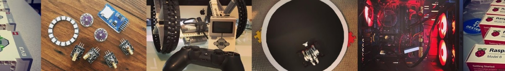

# Intro-to-Web-development

Students will be introduced to design tools, processes, and best practices as they apply to web developers, content strategists, user experience designers, and creative technologists. The skills introduced in this course will be incorporated and reinforced in subsequent courses as part of the practice relevant to each discipline.

[**Let's Get Started**](https://learn.humber.ca/ultra/courses/_233709_1/outline)

